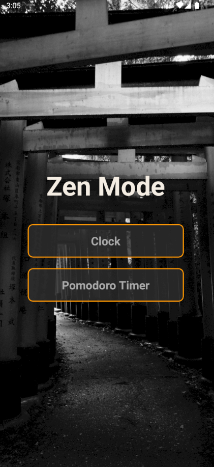
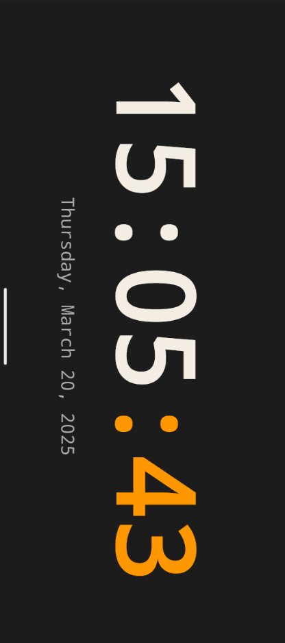
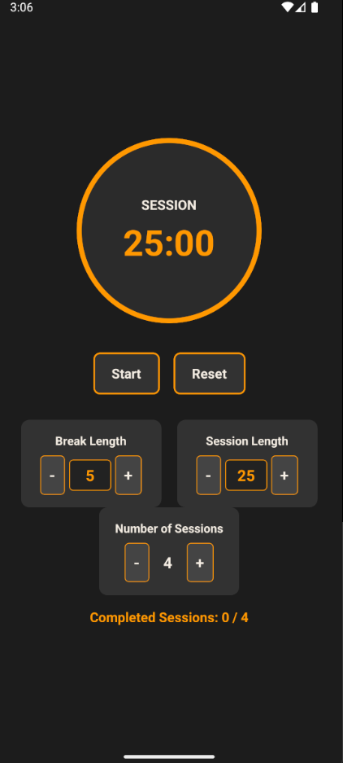

# Zen Mode 🧘‍♂️  

**Zen Mode** is a React Native app designed to help users enter a distraction-free environment for deep focus, mindfulness, and productivity. It allows users to set custom focus sessions, track their productivity, and enhance concentration with a minimalist interface.

---

## 🚀 Features  

- 🎯 **Custom Focus Sessions** – Set timers for deep work sessions.  
- 🔕 **Distraction-Free Mode** – Mute notifications and reduce distractions.   
- ⏳ **Pomodoro Timer** – Use the Pomodoro technique to manage work and breaks.  
- 🌙 **Minimal UI** – Simple and easy-to-use interface.  

---

## 📸 Screenshots  

### Home Screen  


### Clock UI  


### Pomodoro Timer  


---

## 🛠️ Tech Stack  

- **Framework:** React Native  
- **State Management:** React Hooks  
- **Navigation:** React Navigation  

---

## 📦 Installation  

1. **Clone the repository:**  

   ```sh
   git clone https://github.com/Abhishek-yadav-12/ZenMode.git
   cd ZenMode
